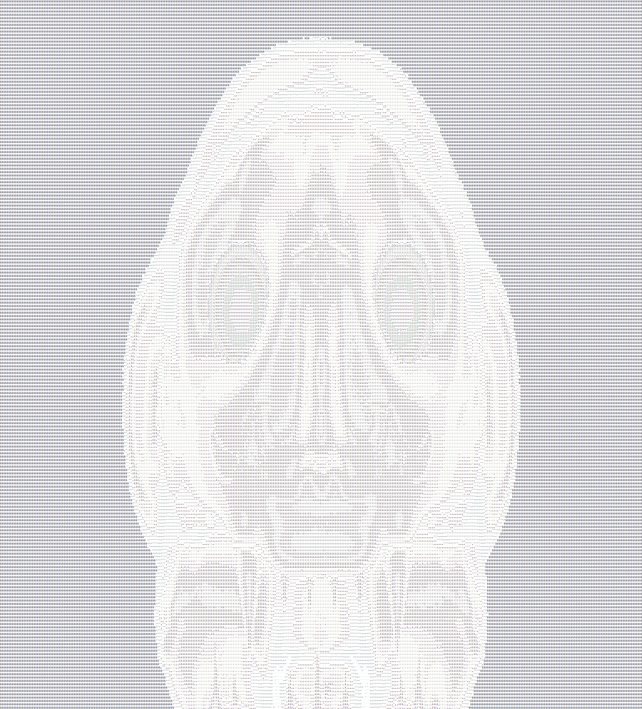
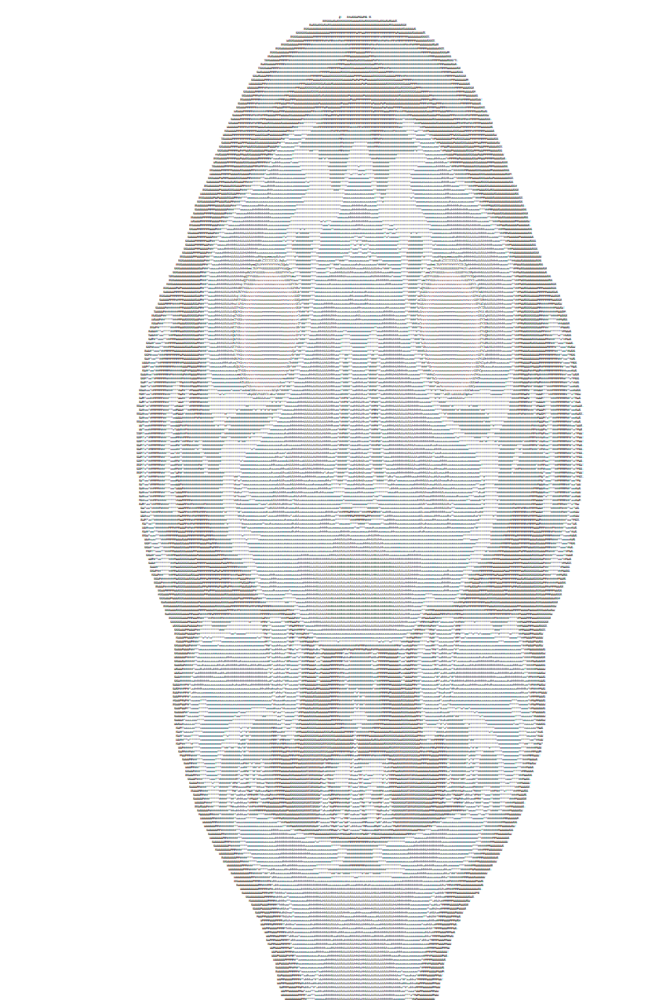

# Image ascifier
* Ascifies the provided image
* Images with lot of colors may look distorted

## Supported image types
* BMP

## Usage
```
Usage: image_ascifier [OPTIONS] --image-path <IMAGE_PATH> --save-path <SAVE_PATH>

Options:
  -i, --image-path <IMAGE_PATH>  Image to ascify
  -s, --save-path <SAVE_PATH>    Ascified image
      --invert                   Inverts the resulting ascii image
      --charset <CHARSET>        Custom charset [default: "$@B%8&WM#*oahkbdpqwmZO0QLCJUYXzcvunxrjft/\\|()1{}[]?-_+~<>i!lI;:,\"^`'. "]
  -h, --help                     Print help
  -V, --version                  Print version
```

## Showcase
All ascii images were screenshoted in notepad at almost max zoom
### Original

### Non inverted

### Inverted
